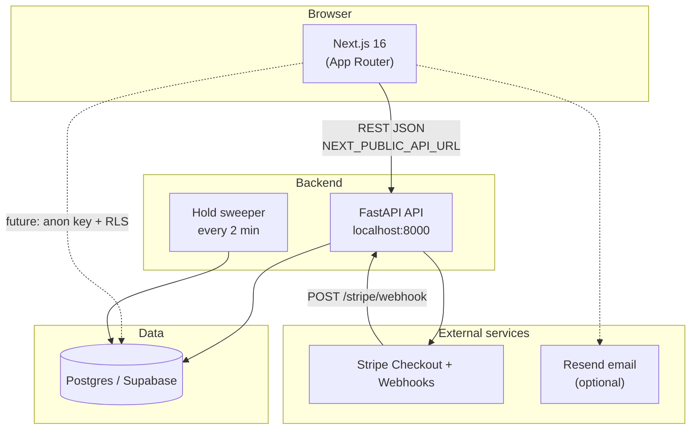
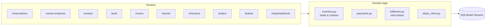
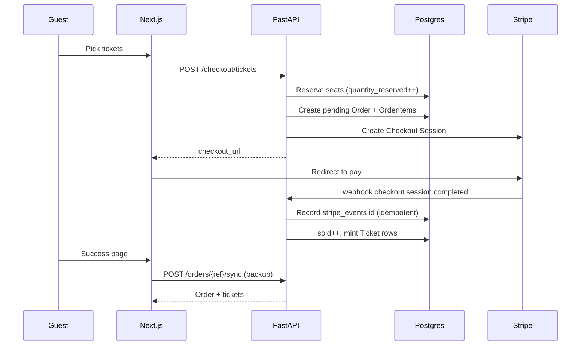

# Sweet1ne LIVE — System Architecture

This document explains how the project is put together: what runs where, how requests flow, and how the pieces connect to Supabase and Stripe.

For every database table, column, and relationship, see **[DATA-MODEL.md](./DATA-MODEL.md)**.

---

## High-level overview

Sweet1ne LIVE is a **website-first** platform for a live music venue:

- **Public site** — menus, events, venue hire, contact, ticket checkout
- **Guest accounts** — optional sign-up to attach orders to a profile
- **Staff tools** — door check-in, dashboards (frontend pages; gated by API keys / future auth)
- **Payments** — Stripe Checkout for tickets and room deposits



---

## Repository layout

| Path | Purpose |
|------|---------|
| `src/` | Next.js frontend (pages, components, styles) |
| `backend/app/` | FastAPI application code |
| `backend/app/models.py` | SQLModel table definitions (source of truth for schema) |
| `backend/app/routers/` | HTTP route handlers grouped by domain |
| `backend/alembic/` | Database migrations |
| `backend/tests/` | Pytest suite (ticketing, inventory, webhooks) |
| `docs/` | Architecture, data model, design notes |
| `.env.local` | **Single secrets file** at repo root (gitignored) — shared by Next.js and FastAPI |
| `vercel.json` | Vercel deploy config (frontend only) |

---

## Technology stack

| Layer | Technology | Role |
|-------|------------|------|
| Frontend | Next.js 16, React 19, Tailwind v4 | Marketing site, checkout UI, staff pages |
| Motion | GSAP, Motion | Cinematic scroll, page transitions |
| Backend | FastAPI | REST API, business rules, Stripe integration |
| ORM | SQLModel (SQLAlchemy + Pydantic) | Python models and DB access |
| Config | pydantic-settings | Loads env from `.env.local` |
| Migrations | Alembic | Versioned schema changes on Postgres |
| Database | SQLite (local fallback) / **Supabase Postgres** (production) |
| Payments | Stripe Checkout + webhooks | Card payments, idempotent fulfilment |
| Auth | Custom JWT + bcrypt | Guest accounts (`/auth/*`); not Supabase Auth yet |

---

## Running the backend

### One command (recommended)

From the **repository root**:

```bash
npm run backend
```

This script automatically:

1. Ensures `.env.local` exists (copies from `.env.example` on first run)
2. Creates `backend/.venv` if missing
3. Installs Python dependencies
4. Runs `alembic upgrade head`
5. Seeds rooms and events (idempotent)
6. Starts Uvicorn at http://localhost:8000

First time only: edit `.env.local` and set `DATABASE_URL` before running again.

### Manual setup

### Environment

Copy the template and fill in values at the **repo root** (not inside `backend/`):

```bash
# from repo root
cp .env.example .env.local
```

The backend reads `../.env.local` automatically via `backend/app/config.py`.

Minimum for local API + Supabase:

| Variable | Purpose |
|----------|---------|
| `DATABASE_URL` | `postgresql+psycopg2://...pooler.supabase.com:5432/postgres` |
| `CORS_ORIGINS` | e.g. `["http://localhost:3000"]` |
| `JWT_SECRET` | Signs guest login tokens |
| `STRIPE_SECRET_KEY` | Optional until you test checkout |
| `STRIPE_WEBHOOK_SECRET` | From `stripe listen` in dev |
| `STAFF_API_KEY` | Protects door check-in endpoints |

Frontend vars in the same file:

| Variable | Purpose |
|----------|---------|
| `NEXT_PUBLIC_API_URL` | Default `http://localhost:8000` |
| `NEXT_PUBLIC_SUPABASE_URL` | For future Supabase client / RLS |
| `NEXT_PUBLIC_SUPABASE_ANON_KEY` | Publishable key |

### Database migrations

```bash
cd backend
alembic upgrade head
```

Test the connection:

```bash
python scripts/test_db_connection.py
```

Seed rooms and a sample event season:

```bash
python -m app.seed
```

### Start the API server

```bash
cd backend
uvicorn app.main:app --reload --host 0.0.0.0 --port 8000
```

| URL | What it is |
|-----|------------|
| http://localhost:8000/health | Liveness check |
| http://localhost:8000/docs | Swagger UI (interactive API) |
| http://localhost:8000/redoc | ReDoc API reference |

The API runs **without Stripe** — catalogue endpoints work; checkout returns 503 until `STRIPE_SECRET_KEY` is set.

### Stripe webhooks (development)

```bash
stripe listen --forward-to localhost:8000/stripe/webhook
```

Copy the printed `whsec_…` into `.env.local` as `STRIPE_WEBHOOK_SECRET`.

### Run tests

```bash
cd backend
python -m pytest tests/ -q
```

---

## Running the frontend

From the repo root:

```bash
npm install
npm run dev
```

Site: http://localhost:3000 — talks to the API via `NEXT_PUBLIC_API_URL`.

---

## Backend internal structure



| Module | Responsibility |
|--------|----------------|
| `inventory.py` | Seat holds, room slot clashes, expiring stale checkouts |
| `payments.py` | Create Stripe sessions, free-order shortcut |
| `fulfilment.py` | Mark orders paid, mint ticket rows, idempotent webhook handling |
| `auth.py` | Password hashing, JWT issue/verify |
| `seed.py` | Seven rooms + sample events for dev |

On startup, a **background sweeper** runs every 120 seconds and releases expired ticket/room holds if a Stripe webhook was missed.

---

## API surface (summary)

| Prefix | Tag | Purpose |
|--------|-----|---------|
| `GET /health` | — | Health + Stripe configured flag |
| `/reservations` | reservations | Table booking requests |
| `/venue-enquiries` | venue-enquiries | Private hire / event enquiries |
| `/contact` | contact | Contact form submissions |
| `/auth` | auth | Register, login, `/auth/me` |
| `/rooms` | rooms | Room catalogue, availability slots |
| `/events` | events | Published events + ticket types |
| `/checkout` | checkout | Start ticket or room-deposit checkout |
| `/orders` | orders | Lookup order, sync with Stripe |
| `/tickets` | tickets | Door check-in (staff key), lookup |
| `/stripe/webhook` | stripe | Stripe event ingestion |

Full request/response shapes: http://localhost:8000/docs when the server is running.

---

## Database access patterns

### Today: direct Postgres (SQLModel)

FastAPI connects with `DATABASE_URL` using the Postgres role. This path:

- Powers all current API endpoints
- Runs Alembic migrations
- **Bypasses Supabase Row Level Security (RLS)** — appropriate for trusted server code

### Future: Supabase client + RLS

Config already exposes `SUPABASE_URL`, anon/publishable key, service role, and JWT secret. You can add `@supabase/supabase-js` on the frontend so the browser talks to PostgREST with the **anon key + user JWT** — RLS policies then apply at the database layer.

You do **not** need a separate Prisma-style `DIRECT_URL`. The session pooler on port **5432** is enough for both the app and Alembic.

| Connection | RLS |
|------------|-----|
| `DATABASE_URL` (SQLModel) | Bypassed |
| Service role key | Bypassed |
| Anon key + signed-in user | Enforced |

See [DATA-MODEL.md](./DATA-MODEL.md) for the full schema.

---

## Payment and fulfilment flow

### Ticket purchase



### Room deposit

Same shape: `POST /checkout/room` → hold booking → Stripe → webhook confirms → `room_bookings.status = confirmed`.

**Rules enforced in code:**

- No double-booking overlapping room time windows
- Published events in a room block conflicting hire slots
- Money stored as **integer pence** only — never floats
- Prices always read from DB, never trusted from the client

---

## Deployment

| Component | Where | Notes |
|-----------|-------|-------|
| Frontend | **Vercel** | `vercel.json` at repo root; set `NEXT_PUBLIC_API_URL` |
| Backend | Railway, Render, Fly, etc. | Not built by Vercel |
| Database | **Supabase Postgres** | Run `alembic upgrade head` against production URL once per release |
| Stripe | Stripe Dashboard | Live keys + webhook endpoint pointing at production API |

After deploy, set `CORS_ORIGINS` and `PUBLIC_SITE_URL` on the API to your Vercel domain.

---

## Security notes

- `.env.local` and `backend/.env` must stay gitignored — never commit secrets
- Door endpoints require `X-Staff-Key: STAFF_API_KEY`
- Guest JWTs use `JWT_SECRET` (separate from Supabase JWT secret today)
- Rotate DB password if credentials were ever exposed in chat or commits

---

## Related documents

| Document | Contents |
|----------|----------|
| [DATA-MODEL.md](./DATA-MODEL.md) | All tables, columns, PKs, FKs, ERDs |
| [DESIGN.md](./DESIGN.md) | Visual / UX design notes |
| [../README.md](../README.md) | Quick start, payments summary, deploy checklist |
