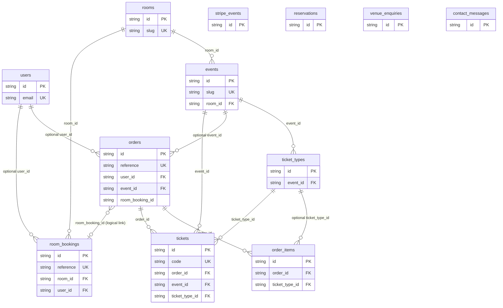
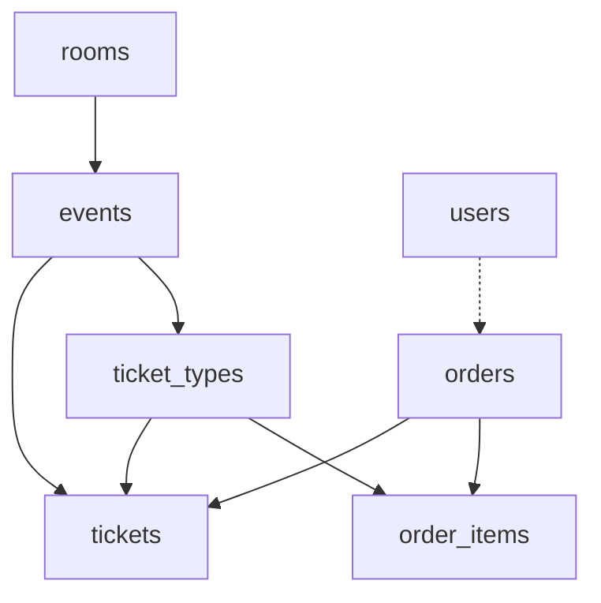
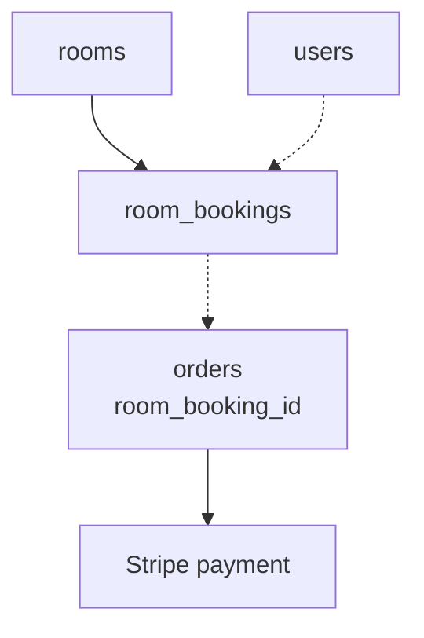

# Sweet1ne LIVE — Data Model

Plain-language reference for every database table: what it stores, why it exists, and how tables link together.

**Source of truth:** `backend/app/models.py`  
**Migrations:** `backend/alembic/versions/` (current head: `2617535e95dc`)

---

## Conventions

| Topic | Rule |
|-------|------|
| Primary keys | String UUIDs (`uuid.uuid4().hex`, 32 hex chars) — except `stripe_events.id` which is Stripe's event id |
| Money | Integer **pence** (e.g. £5.00 → `500`). Column names end in `_pence` |
| Timestamps | UTC `datetime` unless noted |
| Status fields | String enums enforced in application code (not Postgres ENUM types) |
| Guest-readable codes | Order refs `S1L-XXXXXX`, ticket codes `XXXX-XXXX-XXXX` (no ambiguous 0/O/1/I) |

---

## Table index

14 tables in 4 groups:

| Group | Tables |
|-------|--------|
| **Enquiries** | `reservations`, `venue_enquiries`, `contact_messages` |
| **Accounts** | `users` |
| **Venue & events** | `rooms`, `events`, `ticket_types` |
| **Commerce** | `orders`, `order_items`, `tickets`, `room_bookings`, `stripe_events` |

---

## Full entity-relationship diagram



---

## Domain diagram — ticketing flow



---

## Domain diagram — room hire flow



---

## Enquiries (standalone tables)

These tables do not foreign-key to other tables. Staff review them in the dashboard.

### `reservations`

**Use:** Simple table-booking requests from the public site (name, party, date/time).

| Column | Type | Key | Description |
|--------|------|-----|-------------|
| `id` | string | **PK** | Unique id |
| `name` | string(200) | | Guest name |
| `email` | string | | Contact email |
| `party_size` | int | | 1–20 |
| `date` | date | | Reservation date |
| `time` | string | | Requested time slot |
| `notes` | string(500)? | | Optional notes |
| `status` | string | | Default `pending` |
| `created_at` | datetime | | When submitted |

**Foreign keys:** none

---

### `venue_enquiries`

**Use:** Private hire / corporate / birthday enquiries with guest count and event type.

| Column | Type | Key | Description |
|--------|------|-----|-------------|
| `id` | string | **PK** | Unique id |
| `name` | string(200) | | Enquirer name |
| `email` | string | | Contact email |
| `event_type` | string | | e.g. `corporate`, `birthday`, `private-dinner`, `other` |
| `guests` | int | | 1–300 |
| `date` | date | | Preferred date |
| `details` | string(1000)? | | Free-text brief |
| `created_at` | datetime | | When submitted |

**Foreign keys:** none

---

### `contact_messages`

**Use:** General contact form messages.

| Column | Type | Key | Description |
|--------|------|-----|-------------|
| `id` | string | **PK** | Unique id |
| `name` | string(200) | | Sender name |
| `email` | string | | Sender email |
| `subject` | string(200) | | Subject line |
| `message` | string(2000) | | Body |
| `created_at` | datetime | | When submitted |

**Foreign keys:** none

---

## Accounts

### `users`

**Use:** Optional guest accounts. Link orders and room bookings when logged in. Passwords stored as bcrypt hashes.

| Column | Type | Key | Description |
|--------|------|-----|-------------|
| `id` | string | **PK** | Unique id |
| `name` | string(200) | | Display name |
| `email` | string | **UK**, indexed | Login identifier (lowercased in app) |
| `password_hash` | string | | bcrypt hash — never expose via API |
| `created_at` | datetime | | Registration time |

**Foreign keys:** none (referenced by `orders.user_id`, `room_bookings.user_id`)

**Referenced by:**

| Child table | Column | On delete |
|-------------|--------|-----------|
| `orders` | `user_id` | FK → `users.id` (nullable) |
| `room_bookings` | `user_id` | FK → `users.id` (nullable) |

---

## Venue catalogue

### `rooms`

**Use:** The seven bookable spaces. Seeded by `python -m app.seed`. Drives room hire UI and anchors events to a physical space.

| Column | Type | Key | Description |
|--------|------|-----|-------------|
| `id` | string | **PK** | Unique id |
| `slug` | string | **UK**, indexed | URL slug e.g. `the-main-room` |
| `name` | string | | Display name |
| `tagline` | string | | Short marketing line |
| `description` | string | | Long description |
| `capacity_seated` | int | | Seated capacity |
| `capacity_standing` | int | | Standing capacity |
| `min_party` | int | | Minimum party size (default 1) |
| `hire_fee_pence` | int | | Headline "from" price on cards |
| `deposit_pence` | int | | Stripe deposit; `0` = enquiry only |
| `image_url` | string | | Hero image |
| `features` | string | | Comma-separated e.g. `Stage,Private bar` |
| `sort_order` | int | | Display order |
| `is_active` | bool | | Hide from catalogue when false |

**Foreign keys:** none (referenced by `events`, `room_bookings`)

---

### `events`

**Use:** Ticketed live events. Each event happens in one room and has one or more ticket types.

| Column | Type | Key | Description |
|--------|------|-----|-------------|
| `id` | string | **PK** | Unique id |
| `slug` | string | **UK**, indexed | URL slug |
| `title` | string | | Event name |
| `subtitle` | string | | Secondary line |
| `description` | string | | Long copy |
| `room_id` | string | **FK → rooms.id**, indexed | Where it takes place |
| `image_url` | string | | Promo image |
| `doors_at` | datetime? | | Doors open |
| `starts_at` | datetime | indexed | Show start |
| `ends_at` | datetime? | | Show end |
| `status` | string | indexed | `draft` \| `published` \| `cancelled` |
| `created_at` | datetime | | Row created |

**Foreign keys:**

| Column | References |
|--------|------------|
| `room_id` | `rooms.id` |

**Referenced by:** `ticket_types`, `orders`, `tickets`

---

### `ticket_types`

**Use:** Sellable tiers for an event (e.g. General Admission, VIP). Tracks inventory: total, sold, and temporarily reserved during checkout.

| Column | Type | Key | Description |
|--------|------|-----|-------------|
| `id` | string | **PK** | Unique id |
| `event_id` | string | **FK → events.id**, indexed | Parent event |
| `name` | string | | Tier name |
| `description` | string | | Tier description |
| `price_pence` | int | | Unit price |
| `quantity_total` | int | | Capacity for this tier |
| `quantity_sold` | int | | Paid seats (webhook increments) |
| `quantity_reserved` | int | | Held by open checkouts |
| `max_per_order` | int | | Per-cart limit (default 8) |
| `sales_start` | datetime? | | Optional on-sale window start |
| `sales_end` | datetime? | | Optional on-sale window end |
| `sort_order` | int | | Display order |
| `is_active` | bool | | Hide tier when false |

**Available seats (computed in app):**  
`quantity_total - quantity_sold - quantity_reserved`

**Foreign keys:**

| Column | References |
|--------|------------|
| `event_id` | `events.id` |

---

## Commerce

### `orders`

**Use:** Unified payment record for **ticket purchases** and **room deposits**. Tracks Stripe session, expiry, and fulfilment status.

| Column | Type | Key | Description |
|--------|------|-----|-------------|
| `id` | string | **PK** | Internal id |
| `reference` | string | **UK**, indexed | Guest-facing ref e.g. `S1L-A3K9M2` |
| `user_id` | string? | **FK → users.id**, indexed | Set when logged in |
| `customer_name` | string | | Payer name |
| `customer_email` | string | indexed | Payer email (lookup on success page) |
| `kind` | string | | `tickets` \| `room_deposit` |
| `status` | string | indexed | `pending` \| `paid` \| `cancelled` \| `expired` \| `refunded` |
| `subtotal_pence` | int | | Order total |
| `currency` | string | | Default `gbp` |
| `event_id` | string? | **FK → events.id**, indexed | For ticket orders |
| `room_booking_id` | string? | indexed | Links to room booking (**no DB FK constraint**) |
| `stripe_checkout_session_id` | string? | indexed | Stripe Checkout session |
| `stripe_payment_intent_id` | string? | indexed | Stripe PaymentIntent |
| `created_at` | datetime | | Order created |
| `expires_at` | datetime? | | Hold expiry for pending checkouts |
| `paid_at` | datetime? | | When payment confirmed |

**Foreign keys:**

| Column | References |
|--------|------------|
| `user_id` | `users.id` |
| `event_id` | `events.id` |

**Note:** `room_booking_id` is a logical link to `room_bookings.id` but is not declared as a foreign key in the migration (avoids circular create order issues). Application code maintains the relationship.

---

### `order_items`

**Use:** Line items on an order — what was in the cart (description, qty, unit price snapshot).

| Column | Type | Key | Description |
|--------|------|-----|-------------|
| `id` | string | **PK** | Unique id |
| `order_id` | string | **FK → orders.id**, indexed | Parent order |
| `ticket_type_id` | string? | **FK → ticket_types.id** | Source tier (nullable for non-ticket lines) |
| `description` | string | | Line label at time of purchase |
| `quantity` | int | | Units bought |
| `unit_price_pence` | int | | Price per unit at purchase time |

**Foreign keys:**

| Column | References |
|--------|------------|
| `order_id` | `orders.id` |
| `ticket_type_id` | `ticket_types.id` |

---

### `tickets`

**Use:** One row per **seat** after payment. Each has a unique door code for check-in.

| Column | Type | Key | Description |
|--------|------|-----|-------------|
| `id` | string | **PK** | Internal id |
| `code` | string | **UK**, indexed | Door code e.g. `ABCD-EFGH-JKLM` |
| `order_id` | string | **FK → orders.id**, indexed | Originating order |
| `event_id` | string | **FK → events.id**, indexed | Event attended |
| `ticket_type_id` | string | **FK → ticket_types.id**, indexed | Tier purchased |
| `holder_name` | string | | Name on ticket (often customer name) |
| `status` | string | indexed | `valid` \| `checked_in` \| `void` |
| `checked_in_at` | datetime? | | First scan time |
| `created_at` | datetime | | Minted at fulfilment |

**Foreign keys:**

| Column | References |
|--------|------------|
| `order_id` | `orders.id` |
| `event_id` | `events.id` |
| `ticket_type_id` | `ticket_types.id` |

---

### `room_bookings`

**Use:** A requested hire window for a room. Deposit paid via linked `orders` row when `deposit_pence > 0`.

| Column | Type | Key | Description |
|--------|------|-----|-------------|
| `id` | string | **PK** | Unique id |
| `reference` | string | **UK**, indexed | Guest-facing ref (same format as orders) |
| `room_id` | string | **FK → rooms.id**, indexed | Room hired |
| `user_id` | string? | **FK → users.id**, indexed | Optional logged-in guest |
| `name` | string | | Booker name |
| `email` | string | indexed | Contact email |
| `phone` | string | | Phone |
| `party_size` | int | | Head count |
| `date` | date | indexed | Hire date |
| `start_time` | string | | Window start |
| `end_time` | string | | Window end |
| `event_type` | string | | e.g. `corporate`, `birthday`, `performance` |
| `notes` | string? | | Special requests |
| `status` | string | indexed | `pending_payment` \| `confirmed` \| `cancelled` \| `expired` |
| `deposit_pence` | int | | Amount charged |
| `created_at` | datetime | | Booking created |
| `expires_at` | datetime? | | Payment hold expiry |
| `confirmed_at` | datetime? | | When deposit cleared |

**Foreign keys:**

| Column | References |
|--------|------------|
| `room_id` | `rooms.id` |
| `user_id` | `users.id` |

---

### `stripe_events`

**Use:** Idempotency ledger for Stripe webhooks. Primary key = Stripe event id so duplicate deliveries are ignored.

| Column | Type | Key | Description |
|--------|------|-----|-------------|
| `id` | string | **PK** | Stripe event id e.g. `evt_…` |
| `type` | string | | Event type e.g. `checkout.session.completed` |
| `received_at` | datetime | | First time processed |

**Foreign keys:** none

---

## Primary & foreign key summary

### Primary keys

Every table uses a single-column primary key on `id`, except:

| Table | Primary key |
|-------|-------------|
| All entity tables | `id` (UUID hex string) |
| `stripe_events` | `id` (Stripe's event id string) |

### Unique constraints (business keys)

| Table | Unique column(s) |
|-------|------------------|
| `users` | `email` |
| `rooms` | `slug` |
| `events` | `slug` |
| `orders` | `reference` |
| `room_bookings` | `reference` |
| `tickets` | `code` |

### Foreign key map

| From table | Column | To table | To column |
|------------|--------|----------|-----------|
| `events` | `room_id` | `rooms` | `id` |
| `ticket_types` | `event_id` | `events` | `id` |
| `orders` | `user_id` | `users` | `id` |
| `orders` | `event_id` | `events` | `id` |
| `order_items` | `order_id` | `orders` | `id` |
| `order_items` | `ticket_type_id` | `ticket_types` | `id` |
| `tickets` | `order_id` | `orders` | `id` |
| `tickets` | `event_id` | `events` | `id` |
| `tickets` | `ticket_type_id` | `ticket_types` | `id` |
| `room_bookings` | `room_id` | `rooms` | `id` |
| `room_bookings` | `user_id` | `users` | `id` |

### Logical links (no DB FK)

| From | Column | To | Notes |
|------|--------|-----|-------|
| `orders` | `room_booking_id` | `room_bookings.id` | Set for room deposit orders |

---

## Status value reference

| Table | Column | Values |
|-------|--------|--------|
| `reservations` | `status` | `pending` (+ staff workflow in app) |
| `events` | `status` | `draft`, `published`, `cancelled` |
| `orders` | `status` | `pending`, `paid`, `cancelled`, `expired`, `refunded` |
| `orders` | `kind` | `tickets`, `room_deposit` |
| `tickets` | `status` | `valid`, `checked_in`, `void` |
| `room_bookings` | `status` | `pending_payment`, `confirmed`, `cancelled`, `expired` |

---

## Migration history

| Revision | Description |
|----------|-------------|
| `c613c7591a84` | `reservations`, `venue_enquiries` |
| `a1b2c3d4e5f6` | `users`, `contact_messages` |
| `2617535e95dc` | `rooms`, `events`, `ticket_types`, `orders`, `order_items`, `tickets`, `room_bookings`, `stripe_events` |

Apply with:

```bash
cd backend
alembic upgrade head
```

---

## Related documents

- [ARCHITECTURE.md](./ARCHITECTURE.md) — how to run the backend and system design
- [../README.md](../README.md) — quick start and payment flows
